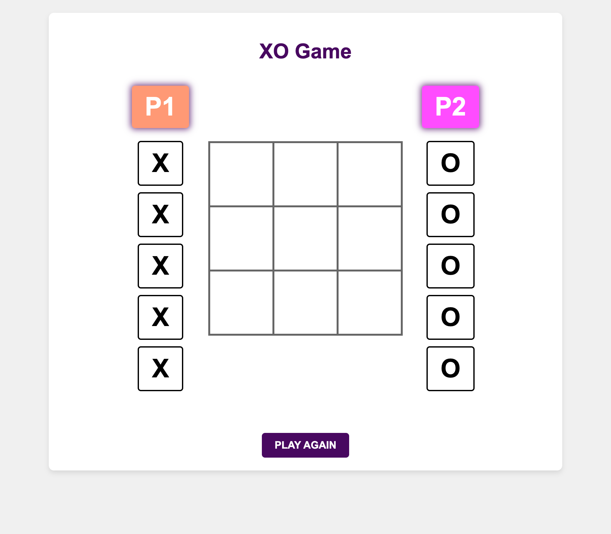
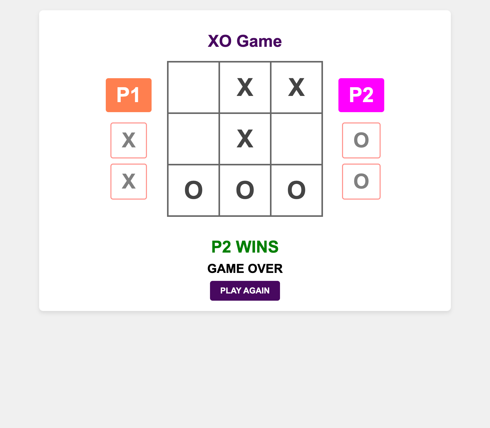

# XO_Game

A classic Tic-Tac-Toe game with a drag-and-drop interface.

## Game Rules

1.  **Two-Player Game:** Play against a friend on a single device.
2.  **Drag and Drop:** Players drag their 'X' or 'O' marks onto the board.
3.  **Flexible Start:** Either player can make the first move. The first player to drop their mark will go first, and turns will alternate from that point on.
4.  **Objective:** Be the first to get three of your marks in a row, column, or diagonal to win.

## How to Play

1.  Open the `index.html` file in your browser.
2.  Drag and drop your 'X' or 'O' mark onto an empty cell on the game board.

## Screenshots

### Game Board

### Winner

### Draw

